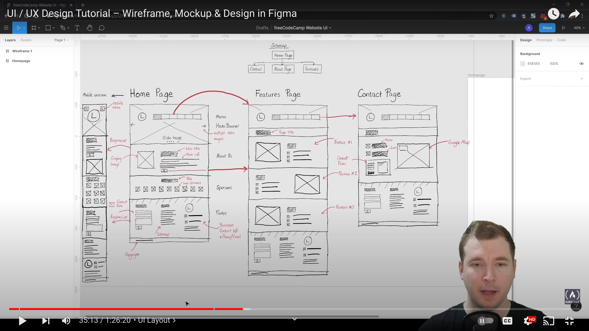

# ui/ux-figma

## Vectore graphic

– when you zoom , pixel’s are not brakes

## Raseter Images

– when you zoom , pixel’s are brakes (jpeg ...)

## constraints

– create responsive design

## constraints

– Work with rectangle

# shortcuts

f - - - - - - - - - - - - - - - - - - - show all the frames !

# Wireframeing

– creating scatch of whats your website look like!
– Blue print of your website !

